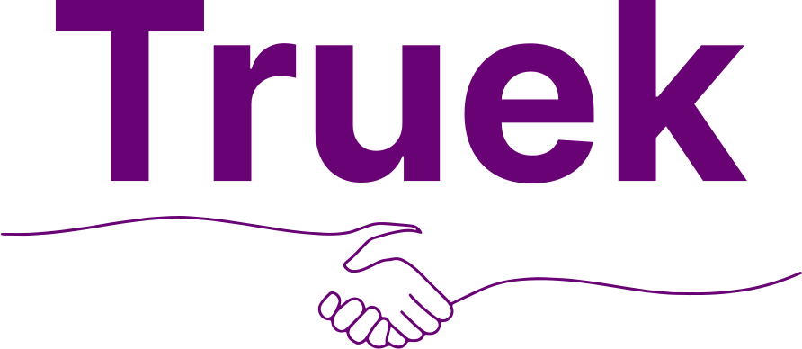

<h1 align="center">
    
</h1>

  

  

  

  

This project was based on the [Omnistack 10 week](https://github.com/rocketseat-education/semana-omnistack-10) by [Rocketseat](https://www.rocketseat.com.br/). Check the links for more details.

  <a href="#-technologies">Technologies</a>&nbsp;&nbsp;&nbsp;|&nbsp;&nbsp;&nbsp;
  <a href="#-project">Project</a>&nbsp;&nbsp;&nbsp;

 

  

## :rocket: Technologies

This project was developed with:

- [Node.js](https://nodejs.org/en/)
- [React](https://reactjs.org)
- [React Native](https://facebook.github.io/react-native/)
- [Expo](https://expo.io/)

##
💻
 Project

Truek App is an application that connects developers to exchange experiences.

## :memo: License

This project is under the MIT license. See the file [LICENSE](LICENSE.md) for more details.
